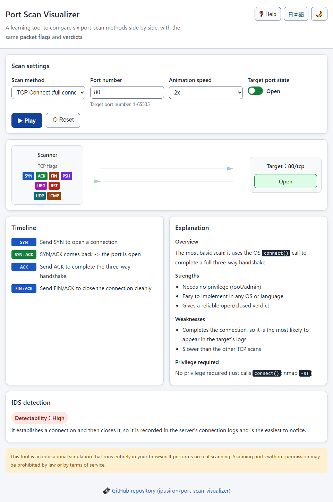
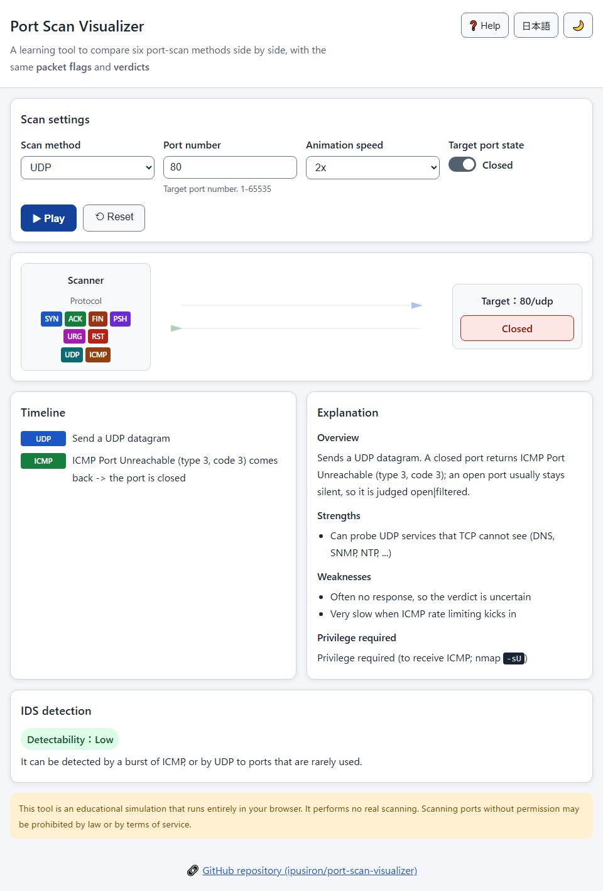
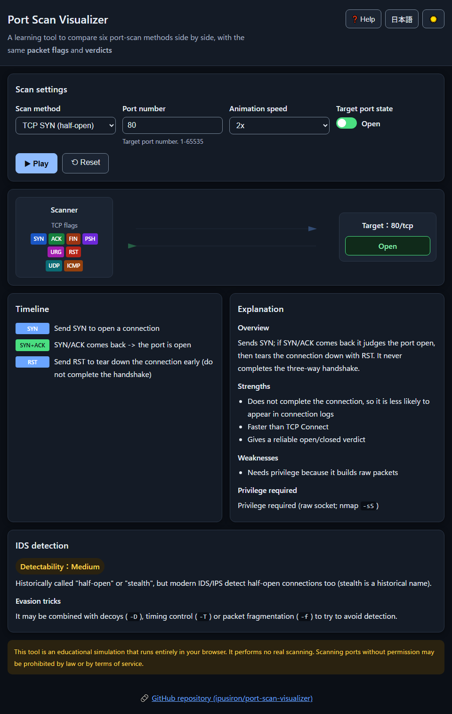
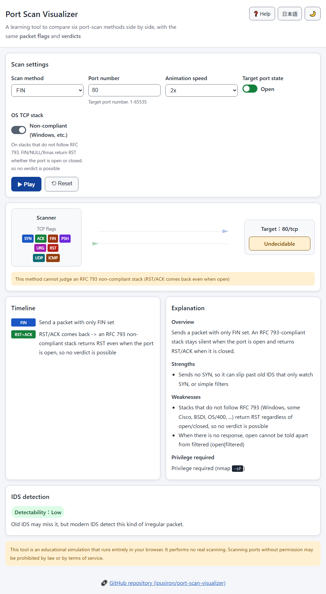

English · [日本語](README.md)


[](https://ipusiron.github.io/port-scan-visualizer/)

**Day062 - 100 Security Tools with Generative AI**

# Port Scan Visualizer - Port Scanning Technique Visualizer

An educational visualizer to compare six port-scan methods (**TCP Connect / TCP SYN / FIN / NULL / Xmas / UDP**) side by side, with the same packet exchange and verdicts.

It performs no real scanning; everything runs as an animation inside your browser. You can follow, step by step, which packets travel back and forth and why the result is Open, Closed or Open|Filtered.

---

## 🌐 Demo

👉 **[https://ipusiron.github.io/port-scan-visualizer/](https://ipusiron.github.io/port-scan-visualizer/)**

You can try it directly in your browser.

---

## 📸 Screenshots

>
>*A TCP Connect scan playing the three-way handshake against an open port*

>
>*A UDP scan where a closed port returns ICMP Port Unreachable*

>
>*A TCP SYN (half-open) scan in dark mode*

>
>*With the OS TCP stack set to non-compliant, a FIN scan returns RST/ACK even when open, so no verdict is possible*

---

## ✨ Features

- Supports six scan methods and compares their packet exchange and verdicts on one screen.
- Color-codes the TCP flags (SYN, ACK, FIN, PSH, URG, RST) so the flag combinations are easy to read.
- Animates the packet movement between the scanner and the target, one step at a time, with SVG.
- Lets you toggle the target port state (open / closed) to compare how the same method responds.
- Explains each method's overview, strengths, weaknesses and privilege, plus IDS detectability and evasion tricks.
- Lets you switch the OS TCP stack between RFC 793-compliant and non-compliant, and see how non-compliant stacks (Windows, etc.) make FIN/NULL/Xmas undecidable.
- Lets you pause and resume playback, and respects the OS "reduce motion" setting by toning down the animation.
- Switches between Japanese and English, and between light and dark themes (your choice is saved automatically).

---

## 📖 How to use

1. Choose a scan method.
2. Toggle the target port state (open / closed).
3. Press "Play" to animate the packet exchange.
4. Read the timeline, explanation and IDS detection to see why the verdict is reached.

The port number must be an integer in `1-65535`. Out-of-range or non-numeric input is reported with an error when you commit it.

---

## 🔍 The six scan methods

| Method | Packet sent | When open | When closed | Privilege |
|------|------|------|------|------|
| TCP Connect | SYN (full connect via `connect()`) | SYN/ACK -> Open | RST/ACK -> Closed | Not needed |
| TCP SYN | SYN (handshake not completed) | SYN/ACK -> Open (aborted with RST) | RST/ACK -> Closed | Needed |
| FIN | FIN | No response -> Open\|Filtered | RST/ACK -> Closed | Needed |
| NULL | No flags | No response -> Open\|Filtered | RST/ACK -> Closed | Needed |
| Xmas | FIN+PSH+URG | No response -> Open\|Filtered | RST/ACK -> Closed | Needed |
| UDP | UDP datagram | No response -> Open\|Filtered | ICMP Port Unreachable (type 3, code 3) -> Closed | Needed |

How each method works, with nmap and RustScan examples, is in [SCANS.md](./SCANS.md).

---

## 🛡️ IDS detection

- Shows detectability as high, medium or low. TCP Connect establishes a connection, so it is the most likely to be logged; FIN, NULL and UDP are less likely.
- TCP SYN is historically called "stealth", but modern IDS/IPS detect half-open connections too (stealth is a historical name).
- Evasion tricks such as decoys, timing control and packet fragmentation are explained together with the method.

---

## 🎯 Use cases

- Show the difference between SYN and Connect scans with an animation in security training or a class.
- When an IDS/IPS log shows an irregular packet such as FIN, visualize which method it corresponds to and share it.
- Let newcomers see, with their own eyes, the difference in responses caused by different flags.

---

## 🔬 Technical notes

- The three-way handshake and each packet exchange follow RFC 9293. A closed port replies with RST/ACK, where ACK is set as well as RST, not RST alone.
- FIN, NULL and Xmas only work on RFC 793-compliant stacks. Windows, some Cisco, BSDI, OS/400 and others return RST regardless of open/closed, so these methods cannot judge them.
- A closed UDP port returns ICMP Port Unreachable (type 3, code 3). An open port usually stays silent, so it is judged Open|Filtered.
- The core logic (packet exchange, verdicts, port validation) is split into `js/psv-core.js` and verified with `node --test`.

---

## 🔒 Security

- No external communication; a CSP limits scripts and styles to same-origin files (`connect-src 'none'`, `object-src 'none'`).
- The on-screen text is built with DOM APIs; it does not build HTML with `innerHTML` or template strings.
- X-Frame-Options and X-Content-Type-Options have no effect as meta elements, so they are not included (clickjacking protection cannot be set via meta on GitHub Pages).

---

## ⚠️ Notes and limitations

- This is an educational simulation and performs no real scanning. Scanning ports without permission may be prohibited by law or terms of service.
- Depending on the implementation and network state, real responses can differ from the diagrams in this tool.
- Firewall drops (Filtered) and the bit-level details of real packets are out of scope.

---

## 🧪 Tests

The core logic, HTML, text, colors and formatting are verified together.

```bash
npm test
```

The same tests run on GitHub Actions (`.github/workflows/test.yml`).

---

## 🔗 References

- [nmap: Port Scanning Techniques](https://nmap.org/book/man-port-scanning-techniques.html)
- RFC 9293 (TCP), RFC 792 (ICMP)
- [Hacking Lab no Tsukurikata, Complete Edition](https://akademeia.info/?page_id=35502) (in Japanese)

---

## 📁 Directory structure

```text
port-scan-visualizer/
├── .github/
│   └── workflows/
│       └── test.yml             # GitHub Actions that runs the tests
├── assets/
│   ├── en/
│   │   ├── screenshot-dark.png  # Screenshot: English, dark mode
│   │   ├── screenshot-rfc.png   # Screenshot: English, RFC compliance toggle
│   │   ├── screenshot-udp.png   # Screenshot: English, UDP scan
│   │   └── screenshot.png       # Screenshot: English, TCP Connect
│   ├── screenshot-dark.png      # Screenshot: dark mode
│   ├── screenshot-rfc.png       # Screenshot: RFC compliance toggle
│   ├── screenshot-udp.png       # Screenshot: UDP scan
│   └── screenshot.png           # Screenshot: TCP Connect
├── js/
│   ├── app.js                   # Screen logic (DOM and animation)
│   ├── i18n.js                  # Language selection and static text
│   ├── messages.js              # Japanese and English text dictionary
│   ├── psv-core.js              # Core logic (packet exchange, verdicts, port validation)
│   ├── theme-init.js            # Applies the theme before rendering
│   └── theme.js                 # Light/dark toggle
├── test/
│   ├── contrast.test.js         # Color contrast checks
│   ├── core.test.js             # Core logic checks
│   ├── format.test.js           # Formatting checks (line length, newlines)
│   ├── html.test.js             # HTML checks (CSP, aria, dictionary match)
│   ├── i18n.test.js             # Language detection checks
│   ├── load.js                  # Helper to load scripts into tests
│   ├── messages.test.js         # Text checks (ja/en parity, primary sources)
│   └── readme.test.js           # README checks
├── .gitignore                   # Git ignore settings
├── .nojekyll                    # Disables Jekyll on GitHub Pages
├── CLAUDE.md                    # Project settings for Claude Code
├── LICENSE                      # MIT license
├── README.en.md                 # This file
├── README.md                    # Japanese README
├── SCANS.md                     # Technical notes on each scan method
├── TODO.md                      # Notes on future improvements
├── index.html                   # Main HTML
├── package.json                 # Test definition
└── style.css                    # Stylesheet
```

---

## 💻 Requirements

- Works in modern browsers (Chrome, Edge, Firefox, Safari).
- No install or build needed. Open `index.html` or serve it from a static server.
- Running the tests needs Node.js 18 or later.

---

## 📄 License

MIT License - see [LICENSE](LICENSE) for details.

---

## 🛠 About this tool

This tool was built as part of the "100 Security Tools with Generative AI" project.
In this project, with the help of AI, a variety of security-related tools are built and released over 100 days.

For details on the project and other tools, see the page below.

🔗 [https://akademeia.info/?page_id=42163](https://akademeia.info/?page_id=42163)
