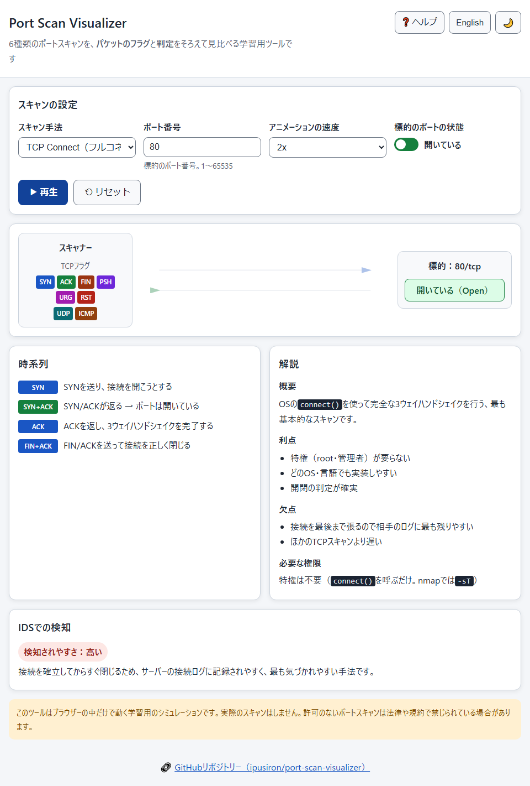
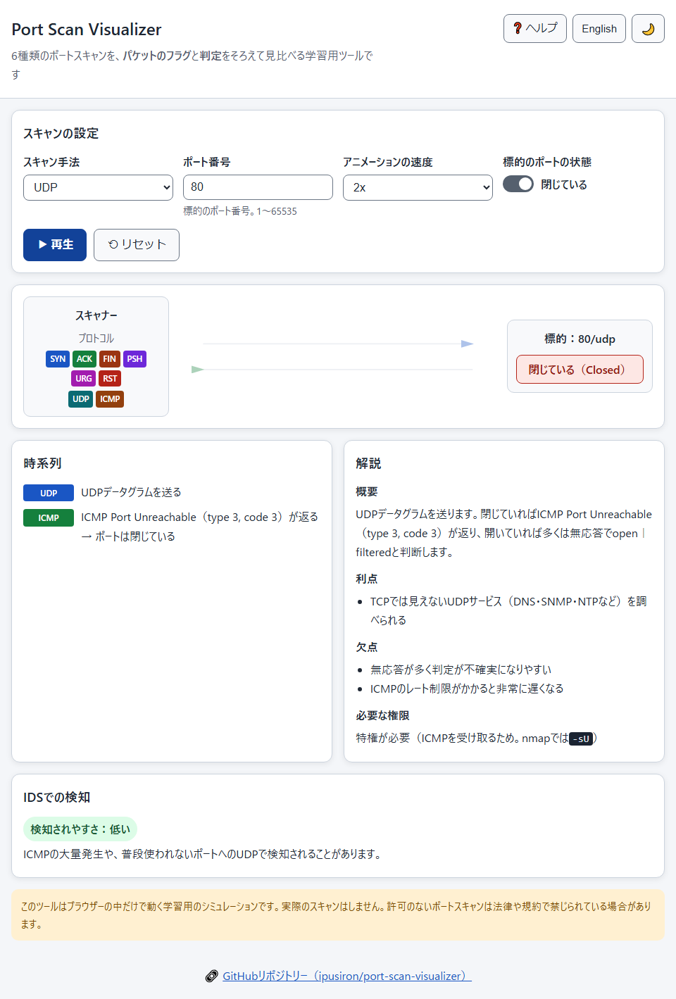
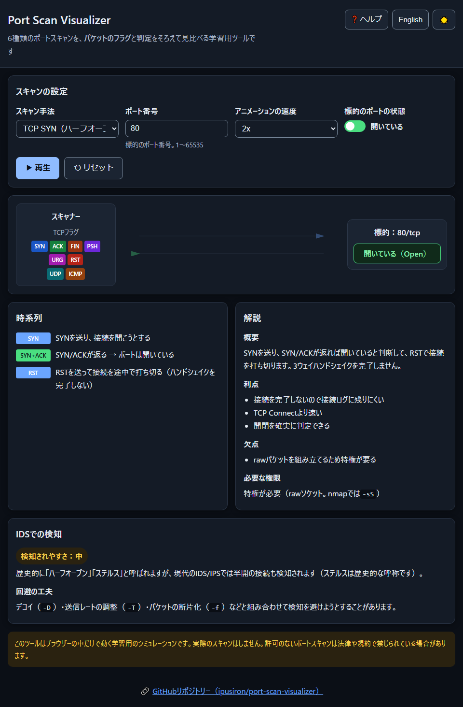
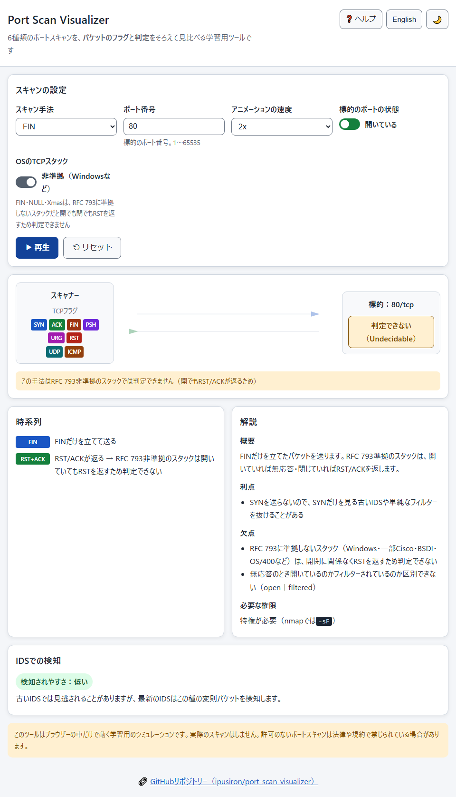

<!--
---
id: day062
slug: port-scan-visualizer
title: "Port Scan Visualizer"
subtitle_ja: "ポートスキャン手法可視化ツール"
subtitle_en: "Port Scanning Technique Visualizer"
description_ja: "代表的な6種類のポートスキャン（TCP Connect / TCP SYN / FIN / NULL / Xmas / UDP）を、パケットの往来と判定をそろえて見比べて学べる学習用の可視化ツール"
description_en: "An educational visualizer to compare six port-scan methods (TCP Connect / TCP SYN / FIN / NULL / Xmas / UDP) side by side, with the same packet exchange and verdicts"
category_ja:
  - ネットワーク
category_en:
  - Network
difficulty: 2
tags:
  - port-scan
  - tcp
  - udp
  - nmap
  - visualization
  - education
repo_url: "https://github.com/ipusiron/port-scan-visualizer"
demo_url: "https://ipusiron.github.io/port-scan-visualizer/"
hub: true
---
-->

[English](README.en.md) · 日本語


[](https://ipusiron.github.io/port-scan-visualizer/)

**Day062 - 生成AIで作るセキュリティツール100**

# Port Scan Visualizer - ポートスキャン手法可視化ツール

代表的な6種類のポートスキャン（**TCP Connect / TCP SYN / FIN / NULL / Xmas / UDP**）を、パケットの往来と判定をそろえて見比べて学べる学習用の可視化ツールです。

実際のスキャンはせず、すべてブラウザーの中のアニメーションで動きます。どのパケットが行き来して、なぜOpen・Closed・Open｜Filteredと判断するのかを、1手順ずつ目で追えます。

---

## 🌐 デモページ

👉 **[https://ipusiron.github.io/port-scan-visualizer/](https://ipusiron.github.io/port-scan-visualizer/)**

ブラウザーで直接お試しいただけます。

---

## 📸 スクリーンショット

>
>*TCP Connectスキャンで、開いているポートへの3ウェイハンドシェイクを再生したところ*

>
>*UDPスキャンで、閉じているポートからICMP Port Unreachableが返るところ*

>
>*ダークモードで、TCP SYN（ハーフオープン）を再生したところ*

>
>*OSのTCPスタックを非準拠にすると、FINスキャンが開いていてもRST/ACKを返して判定できなくなるところ*

---

## ✨ 特徴

- 6種類のスキャン手法に対応し、同じ画面でパケットの往来と判定を見比べられます。
- TCPフラグ（SYN・ACK・FIN・PSH・URG・RST）を色分けして、フラグの組み合わせが一目でわかります。
- スキャナーと標的のあいだのパケットの動きを、SVGアニメーションで1手順ずつ再生します。
- 標的のポートの状態（開いている・閉じている）を切り替えて、同じ手法でも応答がどう変わるかを比べられます。
- 各手法の概要・利点・欠点・必要な権限と、IDSでの検知されやすさ・回避の工夫を解説します。
- OSのTCPスタックをRFC 793準拠・非準拠で切り替えて、非準拠（Windowsなど）だとFIN・NULL・Xmasが判定できなくなる様子を見られます。
- 再生中は一時停止・再開ができ、OSの「視差効果を減らす」設定ではアニメーションを控えめにします。
- 日本語・英語の切り替え、ライト・ダークのテーマ切り替えに対応します（選択は自動で保存されます）。

---

## 📖 使い方

1. スキャン手法を選びます。
2. 標的のポートの状態（開いている・閉じている）を切り替えます。
3. 「再生」を押すと、パケットの往来がアニメーションで流れます。
4. 時系列・解説・IDSでの検知で、なぜその判定になるかを確認します。

ポート番号は`1〜65535`の整数を指定できます。範囲外や数でない入力は、確定のときにエラーで知らせます。

---

## 🔍 6種類のスキャン手法

| 手法 | 送るパケット | 開いているとき | 閉じているとき | 特権 |
|------|------|------|------|------|
| TCP Connect | SYN（`connect()`で完全に接続） | SYN/ACK → Open | RST/ACK → Closed | 不要 |
| TCP SYN | SYN（握手を完了しない） | SYN/ACK → Open（RSTで中断） | RST/ACK → Closed | 必要 |
| FIN | FIN | 無応答 → Open｜Filtered | RST/ACK → Closed | 必要 |
| NULL | フラグなし | 無応答 → Open｜Filtered | RST/ACK → Closed | 必要 |
| Xmas | FIN+PSH+URG | 無応答 → Open｜Filtered | RST/ACK → Closed | 必要 |
| UDP | UDPデータグラム | 無応答 → Open｜Filtered | ICMP Port Unreachable（type 3, code 3） → Closed | 必要 |

各手法の仕組みと、nmap・RustScanでの実行例は[SCANS.md](./SCANS.md)にまとめています。

---

## 🛡️ IDSでの検知

- 検知されやすさを高・中・低で示します。TCP Connectは接続を確立するため最も記録に残りやすく、FIN・NULL・UDPは残りにくい手法です。
- TCP SYNは歴史的に「ステルス」と呼ばれますが、現代のIDS/IPSでは半開の接続も検知されます（ステルスは歴史的な呼称です）。
- デコイ・送信レートの調整・パケットの断片化といった回避の工夫も、手法と一体で解説します。

---

## 🎯 ユースケース

- セキュリティの研修や授業で、SYNスキャンとConnectスキャンの違いをアニメーションで見せる。
- IDS/IPSのログにFINなどの変則パケットが出たとき、どの手法に当たるかを可視化して共有する。
- 新人エンジニアが、紙の図では掴みにくいフラグの違いによる応答の差を目で確かめる。

---

## 🔬 技術的な説明

- 3ウェイハンドシェイクと各パケットの往来はRFC 9293に沿っています。閉じているポートの応答は、RSTだけでなくACKも立つRST/ACKです。
- FIN・NULL・XmasはRFC 793に準拠したスタックでのみ機能します。Windows・一部Cisco・BSDI・OS/400などは開閉に関係なくRSTを返すため、これらの手法では判定できません。
- UDPの閉じているポートはICMP Port Unreachable（type 3, code 3）を返します。開いているポートは無応答が多く、Open｜Filteredと判断します。
- 計算部（パケットの往来・判定・ポート検証）を`js/psv-core.js`に分け、`node --test`で検証しています。

---

## 🔒 セキュリティ

- 外部との通信をせず、スクリプト・スタイルを同じ場所のファイルだけに限るCSPを設定しています（`connect-src 'none'`・`object-src 'none'`）。
- 画面の文字はDOMのAPIで組み立て、`innerHTML`やテンプレート文字列でHTMLを作りません。
- meta要素のX-Frame-OptionsやX-Content-Type-Optionsは効かないため置いていません（クリックジャッキング対策はGitHub Pagesのmetaでは付けられません）。

---

## ⚠️ 注意と限界

- これは学習用のシミュレーションで、実際のスキャンはしません。許可のないポートスキャンは、法律や規約で禁じられている場合があります。
- 実装やネットワークの状態によって、現実の応答は本ツールの図と異なることがあります。
- ファイアウォールでのドロップ（Filtered）や、実機のパケットのビットまでは扱っていません。

---

## 🧪 テスト

計算部・HTML・文言・配色・書式をまとめて検証します。

```bash
npm test
```

GitHub Actions（`.github/workflows/test.yml`）でも同じテストが走ります。

---

## 🔗 参考文献

- [nmap: Port Scanning Techniques](https://nmap.org/book/man-port-scanning-techniques.html)
- RFC 9293（TCP）, RFC 792（ICMP）
- [『ハッキング・ラボのつくりかた 完全版』](https://akademeia.info/?page_id=35502)…「Nmapの代表的なスキャン」（P.440-454）

---

## 📁 ディレクトリー構造

```text
port-scan-visualizer/
├── .github/
│   └── workflows/
│       └── test.yml             # テストを走らせるGitHub Actions
├── assets/
│   ├── en/
│   │   ├── screenshot-dark.png  # 英語・ダークモードのスクリーンショット
│   │   ├── screenshot-rfc.png   # 英語・RFC準拠トグルのスクリーンショット
│   │   ├── screenshot-udp.png   # 英語・UDPスキャンのスクリーンショット
│   │   └── screenshot.png       # 英語・TCP Connectのスクリーンショット
│   ├── screenshot-dark.png      # ダークモードのスクリーンショット
│   ├── screenshot-rfc.png       # RFC準拠トグルのスクリーンショット
│   ├── screenshot-udp.png       # UDPスキャンのスクリーンショット
│   └── screenshot.png           # TCP Connectのスクリーンショット
├── js/
│   ├── app.js                   # 画面の処理（DOMとアニメーション）
│   ├── i18n.js                  # 言語の選択と静的な文言の差し替え
│   ├── messages.js              # 日本語・英語の文言の辞書
│   ├── psv-core.js              # 計算部（パケットの往来・判定・ポート検証）
│   ├── theme-init.js            # 描画前にテーマを当てる
│   └── theme.js                 # ライト・ダークの切り替え
├── test/
│   ├── contrast.test.js         # 配色のコントラストの検査
│   ├── core.test.js             # 計算部の検査
│   ├── format.test.js           # 書式（行長・改行・末尾）の検査
│   ├── html.test.js             # HTML（CSP・aria・辞書との一致）の検査
│   ├── i18n.test.js             # 言語の判定の検査
│   ├── load.js                  # テストにスクリプトを読み込む補助
│   ├── messages.test.js         # 文言（日英の一致・一次資料）の検査
│   └── readme.test.js           # READMEの検査
├── .gitignore                   # Gitの除外設定
├── .nojekyll                    # GitHub PagesでJekyllを無効化
├── CLAUDE.md                    # Claude Code向けのプロジェクト設定
├── LICENSE                      # MITライセンス
├── README.en.md                 # 英語版README
├── README.md                    # このファイル
├── SCANS.md                     # 各スキャン手法の技術解説
├── TODO.md                      # 今後の改善メモ
├── index.html                   # メインのHTML
├── package.json                 # テストの定義
└── style.css                    # スタイルシート
```

---

## 💻 動作環境

- モダンなブラウザー（Chrome・Edge・Firefox・Safari）で動きます。
- インストールやビルドは不要です。`index.html`を開くか、静的サーバーで配信してください。
- テストの実行にはNode.js 18以上が必要です。

---

## 📄 ライセンス

MIT License - 詳細は[LICENSE](LICENSE)を参照してください。

---

## 🛠 このツールについて

本ツールは、「生成AIで作るセキュリティツール100」プロジェクトの一環として開発されました。
このプロジェクトでは、AIの支援を活用しながら、セキュリティに関連するさまざまなツールを100日間にわたり制作・公開していく取り組みを行っています。

プロジェクトの詳細や他のツールについては、以下のページをご覧ください。

🔗 [https://akademeia.info/?page_id=42163](https://akademeia.info/?page_id=42163)
